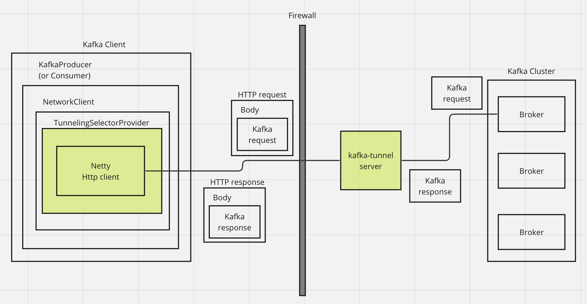

# kafka-tunnel

Tunneling Kafka protocol over HTTP.
This enables you to use your Java Kafka clients in environments where Kafka brokers are behind a firewall and only HTTP is allowed.

> [!WARNING]
> This project is in very early stage of development. It's not ready for production use.

## How it works



- kafka-tunnel provides custom `java.nio.channels.spi.SelectorProvider` implementation which tunnels Kafka protocol over HTTP.
  * It wraps Kafka protocol messages into HTTP request/response.
  * Custom `SelectorProvider` will be installed by service loader.
- kafka-tunnel server is an HTTP server which unwraps Kafka protocol messages from HTTP request/response and forwards them to Kafka brokers.
  * From Kafka broker's perspective, it looks like a normal Kafka client.

## Existing solutions and why I built yet another one

- [REST proxy](https://docs.confluent.io/platform/current/kafka-rest/api.html)
  * REST proxy is a solution which exposes small set of Kafka functionalities through HTTP. 
  * Which means we can't use Kafka clients directly, that prevents reusing existing frameworks and libraries, and the knowledges.
- [kafka-proxy](https://github.com/grepplabs/kafka-proxy)
  * kafka-proxy is a great solution which enables us to use Kafka clients without any code change.
  * However, there are some limitation which prevent me to use it:
      - kafka-proxy needs to set up local-proxy (which kafka-clients connect to) in addition to the application, which is a bit bothersome.
      - kafka-proxy uses HTTP `CONNECT` method, which may not be allowed in some environments.

## Usage

Assuming you have Kafka broker running on `localhost:9092`.

### Server

```
./gradlew :server:shadowJar
java -cp server/build/libs/server-*-SNAPSHOT-all.jar com.mayreh.kafka.http.tunnel.server.TunnelingServer 8080
```

### Client

First, add the dependency to your client app:

```
runtimeOnly 'com.mayreh.kafka-tunnel:client:0.1.0-SNAPSHOT'
```

Then, configure the tunnel server endpoint via Java system property:

```
-Dkafka.http.tunnel.endpoint=localhost:8080
```
